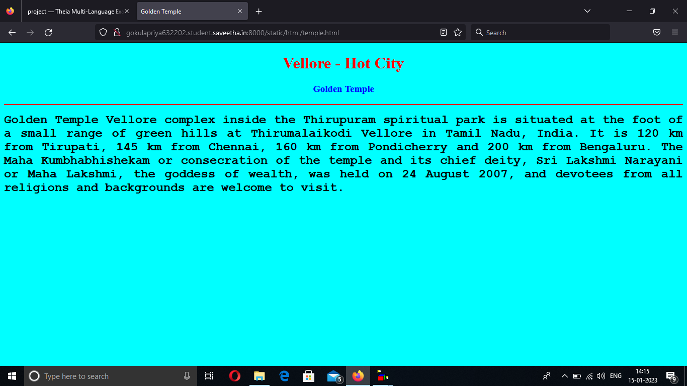
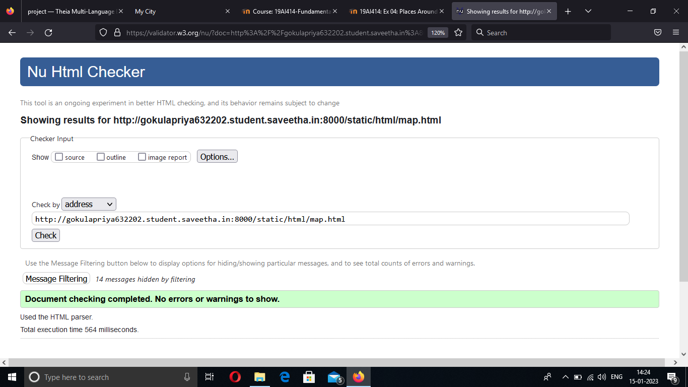

# Places Around Me
## AIM:
To develop a website to display details about the places around my house.

## Design Steps:

### Step 1:
Clone the github repositary into Theia IDE.

### Step 2:
Create a new Django project.

### Step 3:
Write the needed HTML code.

### Step 4:
Run the Django server and execute the HTML files. 

## Code:
```
map.html
<!DOCTYPE html>
<html lang="en">
<head>
<title>My City</title>
</head>
<body>
<h1 align="center">
<font color="red"><b>Vellore = Hot City</b></font>
</h1>
<h3 align="center">
<font color="blue"><b>Gokula Priya P (22008846)</b></font>
</h3>
<center>

<map name="MyCity">
<area shape="circle" coords="190,50,20" href="/static/html/ghs.html" title="Govt. Higher Secondary School">
<area shape="rectangle" coords="230,30,260,60" href="/static/html/rto.html" title="RTO Office">
<area shape="circle" coords="400,350,50" href="/static/html/vk.html" title="Golden Temple">
<area shape="circle" coords="400,200,75" href="/static/html/bus.html" title="Hi-Tech Bus Stand">
<area shape="rectangle" coords="490,150,870,320" href="/static/html/park.html" title="Periyar-Park">
</map>
</center>
</body>
</html>

bus.html

<!DOCTYPE html>
<html lang="en">
<head>
<title>Bus Stand</title>
</head>
<body bgcolor="cyan">
<h1 align="center">
<font color="red"><b>Vellore - Hot City</b></font>
</h1>
<h3 align="center">
<font color="blue"><b>Hi-Tech Bus Stand</b></font>
</h3>
<hr size="3" color="red">
<p align="justify">
<font face="Courier New" size="5">
<b>
Vellore district is a in the state of Tamil Nadu, in southern India. It's known for 16th-centuray Vellore Fort, with its imposing granite walls and surrounding moat. Inside the fort, the Jalakandeswarar Temple features many ornate scult\ptures. Nearby, the Government Museum has prehistoric relics and natural history displays.
</b>
</font>
</p>
</body>
</html>

park.html
<!DOCTYPE html>
<html lang="en">
<head>
<title>Eco-Park</title>
</head>
<body bgcolor="yellow">
<h1 align="center">
<font color="red"><b>Vellore - Hot City</b></font>
</h1>
<h3 align="center">
<font color="blue"><b>Periyar Park</b></font>
</h3>
<hr size="3" color="red">
<p align="justify">
<font face="Tahoma" size="5">
Periyar Park centrally located in the city of Vellore us a spot frequently visited by both locals and tourists. It is a park with state-of-the-art facilities for joggers, family picnics and other pastimes..  In Banyan Tree lot of parrot stay like house. 
Good sound and Air. Lake view park looks awesome

</font>
</p>
</body>
</html>

rto.html
<!DOCTYPE html>
<html lang="en">
<head>
<title>RTO Office</title>
</head>
<body bgcolor="pink">
<h1 align="center">
<font color="red"><b> Vellore - Hot City</b></font>
</h1>
<h3 align="center">
<font color="blue"><b>RTO Office</b></font>
</h3>
<hr size="3" color="red">
<p align="justify">
<font face="Arial" size="5">
<b>
The RTO of Vellore functions as per the guidelines of the Motor Vehicles Act to provide transport-related services.  
The city is known for its leather and tannery industry, and it is also called the leather hub of India for the same reason.
The resultant industrial development has resulted in a significant increase in new vehicle registrations.
The more the vehicle registrations, the more vehicles on the road. Despite a rapid spike in the service requests,
the Vellore Regional Transport offiuce provides efficient vehicle and driver-related services in the city. 
</b>
</font>
</p>
</body>
</html>

ghs.html
<!DOCTYPE html> 
<html lang='en'>
<head>
    <title>Govt. High. Sec. School</title>
</head>
<body bgcolor="cyan">
    <h1 align="center">
        <font color="red"><b>Vellore - Hot City</b></font>
    </h1>
    <h3 align="center">
        <font color="blue"><b>Government Higher Secondary School</b></font>
    </h3>
    <hr size="3" color="red">
    <p align="justify">
        <font face="Georia" size="5">
            The main objective of Vellore Government Higher Secondary School are
            <ul>
               <li>To impart proper and qualified training to teachers and give them an attractive salary and 
                   incentives so that they are not tempted to quit and look elsewhere for jobs.</li>
                <li>To provide financial aids and grants wisely and judiciously.</li>
                <li>To Frame of syllabus and curriculum.</li>
                <li>To set aims and objectives of education.</li>
            </ul>
        </font>
    </p>
</body>
</html>
            
temple.html
<!DOCTYPE html>
<html lang='en'>
<head>
    <title>Golden Temple</title>
</head>
<body bgcolor="cyan">
    <h1 align="center">
        <font color="red"><b>Vellore - Hot City</b></font>
    </h1>
    <h3 align="center">
        <font color="blue"><b>Golden Temple</b></font>
    </h3>
    <hr size="3" color="red">
    <p align="justify">
        <font face="Courier New" size="5">
            <b>
                Golden Temple Vellore complex inside the Thirupuram spiritual park is situated at the foot of a small range of green hills at Thirumalaikodi Vellore in Tamil Nadu, India.
                It is 120 km from Tirupati, 145 km from Chennai, 160 km from Pondicherry and 200 km from Bengaluru. 
                The Maha Kumbhabhishekam or consecration of the temple and its chief deity, Sri Lakshmi Narayani or Maha Lakshmi, the goddess of wealth, was held on 24 August 2007,
                and devotees from all religions and backgrounds are welcome to visit. 
            </b>
        </font>
    </p>
</body>
</html>

```
## output:




## HTML Validator


## Result:
The program for implementing image map is executed successfully